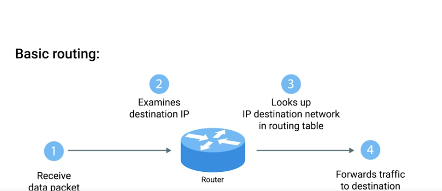

### Router
A network device that forwards traffic depending on the destination address of that traffic 

- Remember, IP addresses belong to networks, ​not individual nodes on a network.

# Example of routing table

| Destination Network | Next Hop   | Total Hops | Interface   |
|---------------------|------------|-----------:|-------------|
| 192.168.1.1/24      | 192.173.0.1 | 5         | 192.173.0.254 |
| 101.66.27.0/24      | 10.11.0.1   | 3         | 10.11.0.25 |
| 192.25.67.0/24      | 10.0.0.3    | 10        | 10.0.0.254 |

### Destination network
This column would contain a row for each network that the router knows about 

### Next hop
This is the IP address of the next router that should receive data intended for the destination networking question 

### Interface
The physical or virtual port on a router that data leaves through to reach its destination.

- The router also has to know which of ​its interfaces it should forward ​traffic matching the destination network out of. 

### Routing protocols 
These are special protocols the router use to speak to each other in order to share what information they might have 

- **Routing protocols** fall into two main categories **interior gateway protocols** and **exterior gateway protocols**

- **interior gateway protocols** are further split into two categories: **Link state routing protocols** and **distance-vector protocols**

### Interior gateway protocols 
Used by routers to share information within a single autonomous system 

### Autonomous system
A collection of networks that all fall under the control of a single network operator 

### Exterior gateway protocols
Are used for the exchange of information between independent autonomous systems 

- The two main types of interior gateway protocols are **link state routing protocols** and **distance-vector protocols**

- Distance vector protocols are an older standard. ​A router using a distance vector protocol basically just takes its routing table, ​which is a list of every network known to it and ​how far away these networks are in terms of hops. ​Then the router sends this list to every neighboring router, ​which is basically every router directly connected to it

- in computer science, a list is known as a vector 

- Routers using a link state protocol take a more sophisticated approach ​to determining the best path to a network. ​Link state protocols get their name because each router ​advertises the state of the link of each of its interfaces. ​These interfaces could be connected to other routers, or ​they could be direct connections to networks. ​The information about each router is propagated to every other router on ​the autonomous system. ​This means that every router on the system knows ​every detail about every other router in the system. ​Each router then uses this much larger set of information and ​runs complicated algorithms against it to determine what the best path to any ​destination network might be

### Internet Assigned Numbers Authority (IANA)
A non-profit organization that helps manage things like IP address allocation 

- Along with managing IP address allocation IANA is also responsible for ASN or autonomous system number allocation 

### Autonomous system number (ASN)
Numbers assigned to individual autonomous systems 

- IPv4 standard doesn't even have enough IP addresses available for every person on the planet 

### Non-routable address space 
They are ranges or IPs set aside for use by anyone that cannot be routed to 

## In Simple Terms

- **Non-routable** = **Private IP addresses**.
- They are used **inside local networks** (homes, schools, offices).
- Devices with **private IP addresses** can communicate with each other on the same network.
- They **cannot communicate directly over the Internet** using those private IP addresses.
- A router using **Network Address Translation (NAT)** translates private IP addresses into a **public IP address** so devices can access the Internet.

> **Easy way to remember:**
>
> 🏠 **Private (non-routable) IP** = Your house address inside a gated neighborhood. It only works within that neighborhood.
>
> 🌎 **Public IP** = Your mailing address that the rest of the world can use to reach you.