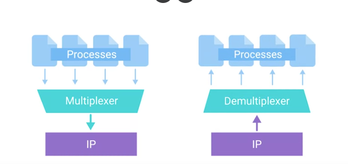
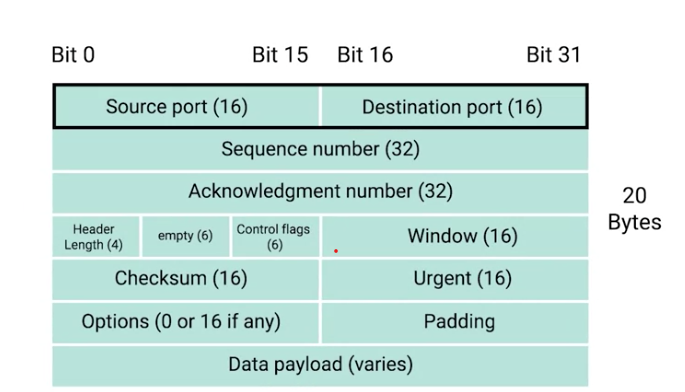
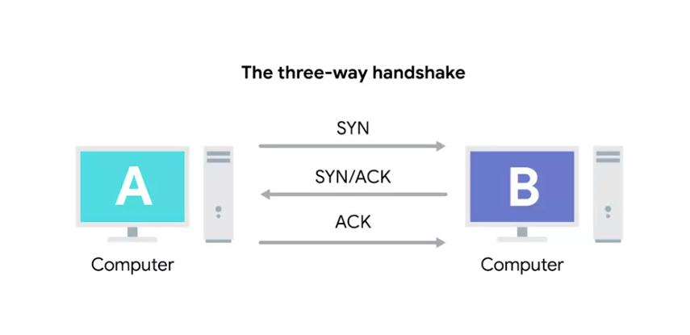
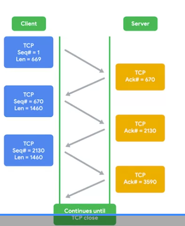
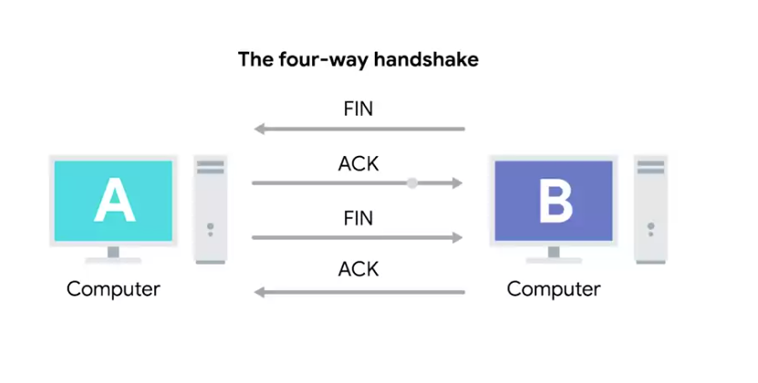

### Transport layer
Allows traffic to be directed to specific network applications

### Application layer
Allows these applications to communicate in a way they understand 

# Transport Layer Notes
- The **Transport Layer** is responsible for reliable communication between devices.
- Its main jobs include:
  - **Multiplexing** network traffic
  - **Demultiplexing** network traffic
  - Establishing long-lasting connections
  - Checking for errors and verifying data integrity

## Learning Objectives
By the end of this lesson, you should be able to:

- Explain **multiplexing** and **demultiplexing**
- Identify the differences between **TCP** and **UDP**
- Understand the **TCP three-way handshake**
- Explain how **TCP flags** are used
- Describe how **firewalls** help protect networks

## Multiplexing
- Allows a device to send network traffic to **multiple services** at the same time.
- The **Transport Layer** directs data to the correct destination service.

## Demultiplexing
- Occurs on the receiving device.
- Takes incoming traffic and delivers it to the **correct application or service**.

## Ports
A 16-bit number that's used to direct traffic to specific services running on a networked computer 

- FTP is an older method used for transferring files from one ​computer to another, but you still see it in use today. ​FTP traditionally listens on port 21, so if you wanted to establish a connection to ​an FTP server running on the same IP that our example web server was running on, ​you direct traffic to 10.1.1.100 port 21.

- Just like how an Ethernet frame ​encapsulates an IP datagram, ​an IP datagram encapsulates a TCP segment

- Remember that an Ethernet frame has a payload section, ​which is really just the entire contents ​of an IP datagram. ​Remember also that an IP datagram has a payload section, ​and this is made up of what's known as a TCP segment.

### TCP segment
Made up of a TCP header and a data section 

- This data section, as you might guess, ​is just another payload area for ​where the application layer places its data.

- A TCP header itself is split ​into lots of fields containing lots of information

### Destination port 
The port of the service the traffic is intended for 

### Source port
A high-numbered port chosen from a special section of ports known as ephemeral ports 

### Sequence number
A 32-bit number that's used to keep track of where in a sequence of TCP segments this one is expected to be 

### Acknowledgement number
The number of the next expected segment 

### Data offset field 
A 4-bit number that communicates how long the TCP header for this segment is 

### TCP checksum
Specifies the range of sequence numbers that might be sent before an acknowledgement is requited 

- the checksum is calculated across ​the entire segment and is compared with ​the checksum in the header to make sure that there ​was no data lost or corrupted along the way. 

### Urgent pointer field
Used in conjunction with one of the TCP control flags to point out particular segments that might be more important than others 

### Options field 
It is sometimes used for more complicated flow control protocols 

# TCP Control flags
- **URG (urgent)**
A value of one here indicates that the segment is considered urgent and that the urgent pointer field has more data about this 
- **ACK (acknowledged)**
A value of one in this field means that the acknowledgement number field should be examined 
- **PSH (push)**
The transmitting device wants the receiving device to push currently-buffered data to the application on the receiving end as soon as possible 
- **RST (reset)**
One of the sides in a TCP connection hasn't been able to properly recover from a series of mission or malformed segments 
- **SYN (synchronized)**
It's used when first establishing a TCP connection and makes sure the receiving end knows to examine the sequence number field 
- **FIN (finish)**
When this flag is set to one, it means the transmitting computer doesn't have any more data to send and the connection can be closed 

### Handshake 
a Way for two devices to ensure that they're speaking the same protocol and will be able to understand each other 

- Once one of the devices involved with the TCP connection is ready to ​close the connection, something known as a four-way handshake happens.

### Socket 
The instantiation of an end-point in a potential TCP connection

### Instantiation
The actual implementation of something defined elsewhere

# Socket States 

- **LISTEN**
A TCP socket is ready and listening for incoming connections 

- **SYN_SENT**
A synchronization request has been sent, but the connection hasn't been established yet 

- **SYN-RECEIVED**
A socket previously in a LISTEN state has received a synchronization request and sent a SYN/ACK back 

- **ESTABLISHED**
The TCP connection is in working order and both sides are free to send each other data 

- **FIN_WAIT**
A FIN has been sent, but the corresponding ACK from the other end hasn't been received yet 

- **CLOSE_WAIT**
The connection has been closed at the TCP layer, but that application that opened the socket hasn't released its hold on the socket yet

- **CLOSED**
The connection has been fully terminated and that no further communication is possible 

- ​When troubleshooting issues at the TCP layer, ​make sure you check out ​the exact socket state definitions ​for the systems you're working with. 

### Connection-oriented protocol 
establishes a connection, and uses this to ensure that all data has been properly transmitted 

- ​You have to tear the connection down at the end that all accounts for ​a lot of extra traffic. ​While this is important traffic, it's really only useful if you absolutely, ​positively have to be sure your data reaches its destination. ​You can contrast this with connectionless protocols. ​The most common of these is known as UDP or User Data Cram Protocol. ​Unlike TCP, UDP doesn't rely on connections and ​it doesn't even support the concept of an acknowledgement. ​With udp, you just set a destination port and send the packet. ​This is useful for messages that aren't super important. 

- ​A great example of UDP is streaming video​, Let's imagine that each UDP datagram is a single frame of a video. ​For the best viewing experience. ​You might hope that every single frame makes it to the viewer, but ​it doesn't really matter if a few get lost along the way. ​A video will still be pretty watchable unless it's missing a lot of its frames. ​By getting rid of all the overhead of tcp, ​you might actually be able to send higher quality video with udp. ​That's because you'll be saving more of the available bandwidth for ​actual data transfer instead of the overhead of establishing connections and ​acknowledging delivered data segments. 

# System Ports vs. Ephemeral Ports - Short Notes

## Ports

- A **port** is a **16-bit number** used to direct network traffic to the correct service.
- There are **65,535** possible port numbers.
- Ports operate at the **Transport Layer**.

## Service vs. Client

- **Service (Server):** Waits for incoming data requests.
- **Client:** Requests data from a service.

## TCP and Sockets

- **TCP** establishes network connections and transfers data.
- A **TCP segment** specifies which ports are used.
- A **socket** is an **active port** that is listening for incoming connections.

## Port Categories (IANA)

### System Ports (1–1023)

- Reserved for common services.
- Examples:
  - **FTP:** Port **21**
  - **Telnet over TLS/SSL:** Port **992**
- Typically not used for outbound traffic on modern operating systems.

### User Ports (1024–49151)

- Registered for vendor-specific applications.
- Used by many server applications.

### Ephemeral (Dynamic) Ports (49152–65535)

- Temporary ports used by **clients**.
- Used for short-lived network connections.

## TCP Data Integrity

TCP ensures reliable communication by using:

- **Acknowledgments (ACKs):** Confirm data was received.
- **Checksums:** Verify data was not corrupted during transmission.

## Port Security

- Open ports can be exploited by attackers.
- **Port scanning** is used to find open or vulnerable ports.
- Use a **firewall** to:
  - Protect ports
  - Block unauthorized access
  - Open only the ports that are needed

## Key Facts

- **Port:** A 16-bit number that directs network traffic.
- **Socket:** An active, listening port.
- **TCP:** Provides reliable data transfer using acknowledgments and checksums.
- **IANA** divides ports into:
  - **System:** 1–1023
  - **User:** 1024–49151
  - **Ephemeral:** 49152–65535

### Firewall 
A device that blocks traffic that meets certain criteria

- ​All major modern operating systems ​have firewall functionality built in. ​That way, blocking or ​allowing traffic to various ports and ​therefore to specific services ​can be performed at the host level as well. 