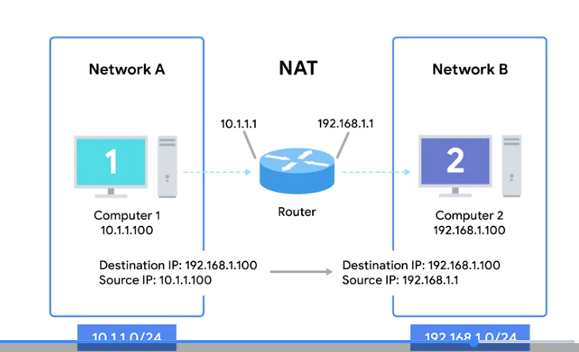

Network Address Translation does ​pretty much what it sounds like. 
​It takes one IP address and translates it into another. ​There are lots of reasons why you would want to do this. ​They range from security safeguards to ​preserving the limited amount of available IPv4 space. ​

### Network Address Translation (NAT)
A technology that allows a gateway, usually a router or firewall, to rewrite the source IP of an outgoing IP datagram while retaining the original IP in order to rewrite it into the response 

# How NAT Works

1. A device sends a packet to another network.
2. The router receives the packet.
3. The router **changes (translates) the source IP** to its own IP address.
4. The destination device thinks the packet came from the router.
5. The reply is sent back to the router.
6. The router **changes the destination IP back** to the original internal device.
7. The internal device receives the response.

# IP Masquerading
- NAT **hides the real IP addresses** of devices on the private network.
- External devices only see the **router's IP address**.
- This provides an extra layer of **security** because internal devices are not directly exposed.

# One-to-Many NAT
- **Many private devices** share **one public IP address**.
- Commonly used in **home and business networks**.
- Makes the entire private network appear as a **single device** to the outside world.

### Port Preservation
A technique where the source port chosen by a client is the same port used by the router

### Port forwarding 
A technique where specific destination ports can be configured to always be delivered to specific nodes 