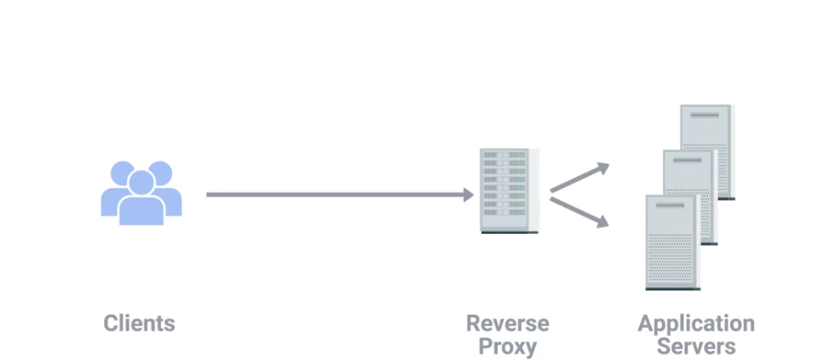

### Virtual Private Networks (VPN)
A technology that allows for the extension of a private or local network to hosts that might not work on that same local network 
- But the most common example of how VPNs are used is for ​employees to access their business's network ​when they're not in the office.
- The employee could use a VPN client ​to establish a VPN tunnel to their company network. ​This would provision their computer ​with what's known as a virtual interface with ​an IP that matches ​the address space of ​the network they've established a VPN connection to. ​By sending data out of this virtual interface, ​the computer could access internal resources ​just like if it was physically ​connected to the private network.
- VPNs were one of ​the first technologies where ​two-factor authentication became common.

### Two-factor authentication
A technique where more than just a username and password are required to authenticate 

### Proxy service
A server that acts on behalf of a client in order to access another service 

# Proxies sit between clients and ​other servers providing some additional benefit
- Anonymity
- Security
- Content filtering 
- Increased performance 

### Web Proxy:
A server that acts as an intermediary between a client and the internet, receiving requests from the client, forwarding them to web servers, and returning the responses. Web proxies can improve security, filter content, cache web pages to improve performance, and hide a client's IP address.
- example: A company might decide that accessing ​Twitter during work hours reduces productivity. ​By using a web proxy, ​they can direct all web traffic to it, ​allow the proxy to inspect what data is being requested, ​and then allow or deny this request, ​depending on what site is being accessed. 

### Reverse proxy
A service that might appear to be a single server to external clients, but actually represents many servers living behind it 

# What are some use cases for reverse proxies? 
- Load balancing 
- Encryption and Decryption 