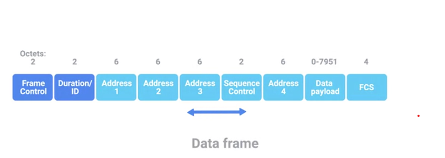
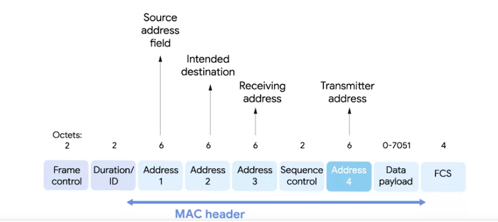

### Frequency band
A certain section of the radio spectrum that's been agreed upon to be used for certain communications 

- In North America, FM radio transmissions operate between 88 and 108 MHz
- ​WiFi networks operate on a few different frequency bands, ​most commonly the 2.4 gigahertz and 5 gigahertz bands. 
- ​There are lots of 802.11 specifications, ​including some that exist just experimentally or for testing. ​
# The most common specifications are
- 802.11B 
- ​802.11A 
- 802.11G 
- 802.11N 
- 802.11AC

- 802.11 = physical and data link layers 
- this has a number of fields

### Frame control field
is 16 bits long and contains a number of subfields that are used to describe how the frame itself should be processed 

### Duration field
It specifies how long the total frame is, so the receiver knows how long it should expect to have to listen to this transmission 

### Wireless access point
A device that bridges the wireless and wired portions of a network 

- ​There are four address fields because there needs to be room to indicate which ​wireless access point should be processing the frame. 

### Receiver address 
The MAC address of the access point that should receive the frame 

### Transmitter address 
The MAC address of whatever has just transmitted the frame

- ​Since all addresses in an 802.11 frame are Mac addresses, ​each of those four fields is six bytes long. 

### Sequence Control field
Is 16 bits long and mainly contains a sequence number used to keep track of the ordering of frames 

### Data payload
Has all of the data of the protocols further up the stack 

### Frame check sequence field
contains a checksum used for a cyclical redundancy check, just like how ethernet does it 

# IoT Data Transfer Protocols

## IoT Models

**Request/Response**
- Client asks → server responds.
- Example: HTTP, CoAP.

**Publish/Subscribe**
- Publisher sends → subscribers receive through a broker.
- Example: MQTT, AMQP.

## Important Protocols

**HTTP/HTTPS**
- Common web protocol.
- Uses request/response.
- HTTPS = secure version.

**MQTT**
- Most important IoT protocol.
- Uses publish/subscribe.
- Lightweight and efficient.
- Uses TCP + TLS security.

**CoAP**
- Lightweight IoT version of HTTP.
- Used for small devices.

**AMQP**
- Messaging protocol.
- Reliable and secure.

**XMPP**
- Messaging/communication protocol.

**DDS**
- Fast IoT data sharing.
- Uses publish/subscribe.

# Main idea:
IoT devices use lightweight protocols to send data efficiently.
MQTT = one of the most common IoT protocols.

# Wireless Network Configurations
**Ad-hoc Networks**
- Devices connect directly to each other without a router.
- Example: Phone sharing files directly with a laptop.
- In an ad-hoc network, there isn't really any supporting network infrastructure

**Wireless LANs (WLANs)**
- A LAN that uses Wi-Fi instead of cables.
- Example: Home Wi-Fi network.

**Mesh Networks**
- Multiple devices (nodes) work together to spread a network.
- Example: Wi-Fi mesh systems covering a large house.

### Channels 
Individual, smaller sections of the overall frequency band used by a wireless network 

### Collision domain
Any one network segment where one computer can interrupt another 

​So why is this important in the world of IT support? ​Well, understanding how these channels overlap for ​all of the 802.11 specifications is a way you can help troubleshoot bad ​wireless connectivity problems or slowdowns in the network. ​You want to avoid collision domains wherever you can. ​I should call out that it's not important to memorize all of the individual numbers ​we've talked about. ​The point is to understand how collision domains are a necessary problem with ​all wireless networks and how you can use your knowledge in this space ​to optimize wireless network deployments. ​You want to make sure that both your own access points and ​those of neighboring businesses overlap channels as little as possible. 

# ​When you're sending data over a wired link, ​
your communication has a certain amount of inherent privacy. ​The only devices that really know what data is being transmitted are the two ​nodes on either end of the link. ​Someone or ​some device that happens to be in close proximity can't just read the data. ​With wireless networking, this isn't really the case. ​Since there aren't cables, just radio transmissions being broadcast through ​the air, anyone within range could hypothetically intercept any ​transmissions, whether they were intended for them or not. ​To solve this problem, WEP was invented.

### Wired Equivalent Privacy (WEP)
An encryption technology that provides a very low level of privacy 
- The more bits in a key, the longer it takes for someone to crack the encryption. ​WEP only uses 40 bits for its encryption keys, and with the speed of modern ​computers, this can usually be cracked in just a few minutes. 
- ​WEP was quickly replaced in most places with WPA, or Wi-Fi Protected Access. ​WPA by default uses a 128-bit key, ​making it a whole lot more difficult to crack than WEP. ​WPA2 uses a 256-bit key, making it even harder to crack. ​Another common way to help secure wireless networks is through MAC filtering.

### MAC filtering
You configure your access points to only allow for connections from a specific set of MAC addresses belonging to devices you trust 

# Mobile Device Networks 
**Cellular Networks**
- Use cell towers to provide mobile connections.
- Example: 4G/5G phone networks.

**Wi-Fi**
- Wireless LAN technology.
- Connects devices to a local network and the Internet.

**Bluetooth**
- Short-range wireless connection.
- Used for devices like headphones, keyboards, and watches.

**IoT Network Protocols**
- Rules that let IoT devices communicate.
- Designed to use low power and send small amounts of data.
- Examples: MQTT, CoAP.

# IoT (Internet of Things)

- Physical devices connected to a network/Internet.
- Devices collect and share data.

Examples:
- Smart thermostat
- Smart lights
- Smart watches
- Security cameras
- Factory sensors

## Remember:
IoT = Things + Internet + Data

# IoT Wireless Protocols

**Wi-Fi**
- Common wireless network.
- Fast, connects IoT devices to the Internet.
- Uses 2.4 GHz and 5 GHz.

**IEEE 802.15.4**
- Low-power wireless standard for IoT.
- Used by ZigBee, Thread, and Z-Wave.

**ZigBee**
- Low-power smart home protocol.
- Uses mesh networks.

**Thread**
- Low-power IPv6 mesh network.
- Used by smart home devices.

**Z-Wave**
- Low-power smart device mesh network.
- Common in home automation.

**Wireless Mesh Network**
- Devices (nodes) pass data to each other.
- Self-healing if a node fails.

**Bluetooth**
- Short-range wireless connection.
- Used for small IoT devices.

**NFC**
- Very short-range communication.
- Used for payments and device pairing.

**LoRaWAN**
- Long-range, low-power IoT network.
- Used for widely spread devices.

# Main idea:
IoT uses wireless protocols that save power and send small amounts of data.

# What are wireless channels
- Individual, smaller sections of the overall frequency band used by a wireless network
- A channel represents a portion of a frequency band.