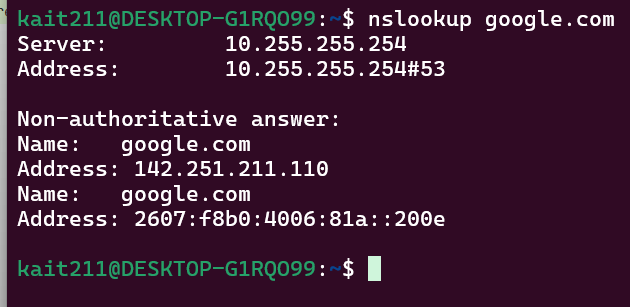

### nslookup
​A basic use of nslookup is pretty simple. ​You execute the nslookup command ​with the host name following it, ​and the output displays what server was ​used to perform the request and the resolution result. 

### set debug
This will allow the tool to ​display the full response packets, ​including any intermediary requests ​and all of their contents. 
​Warning, this is a lot of data and can contain ​details like the TTL left if it's a cached response, ​all the way to the serial number of ​the zone file the request was made against. 

An ISP almost always gives you access to a **recursive name server** as part of the service it provides.

### Public DNS servers 
Name servers specifically set up so that anyone can use them, for free 

- The IP addresses for Level 3's public DNS servers ​are 4.2.2.1 through 4.2.2.6.

- ​Google operates public name servers on ​the IPs 8.8.8.8 and 8.8.4.4.

Most public DNS servers are available globally through **anycast**

**Always** make sure the name server is run by **reputable company, and try to use the name servers provided by **your ISP** outside of troubleshooting scenarios 

### Registrar 
An organization responsible for assigning individual domain names to other organizations or individuals 

The **original** way that numbered network addresses were correlated with words was through **hosts files**

### Hosts file
A flat file that contains, on each line, a network address followed by the host name it can be referred to as'
- For example, a line in a host file might ​read 1.2.3.4 web server. ​This means that on ​the computer where this host file resides, ​a user could just refer to web server ​instead of the IP 1.2.3.4. ​Hosts files are evaluated by ​the networking stack of the operating system itself. 

### Loopback address
A way of sending network traffic to yourself 

Almost every hosts file in existence will, in the very least, contain a line that reads 127.0.0.1 localhost, most likely followed vy ::1 localhost, where ::1 is the loopback address for IPv6

Hosts files are a popular way for computer viruses to disrupt and redirect users' traffic 

​It's not a great idea to use host files today, ​but they do have some useful troubleshooting purposes ​that can be helpful in IT support. ​Host files are examined before ​a DNS resolution attempt ​occurs on just about every major operating system. ​This lets you force an individual computer to think ​a certain domain name always points at a specific IP