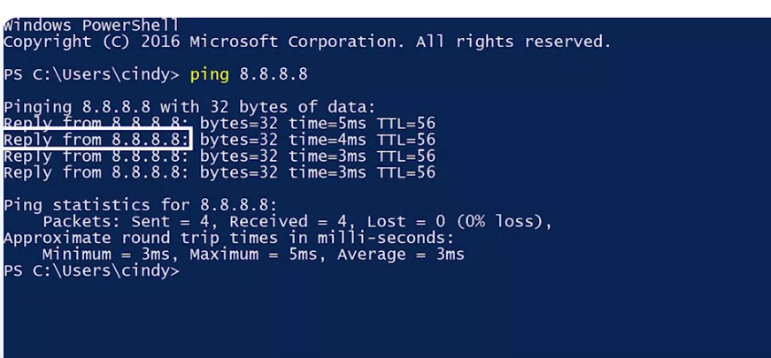
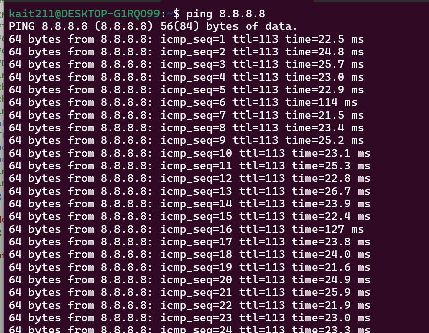
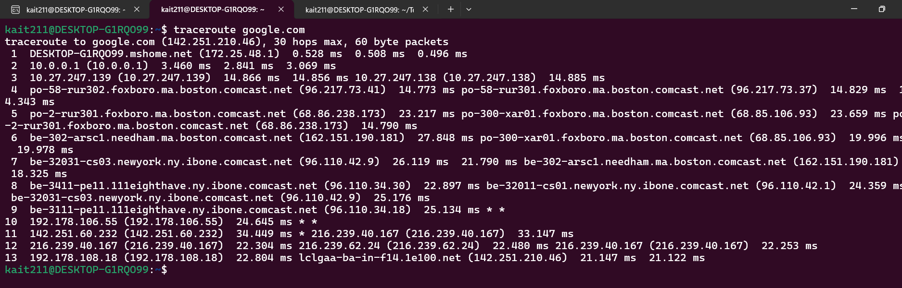
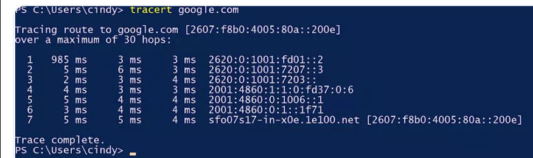

### Error-detection
The ability for a protocol or program to determine that something went wrong 

### Error-recovery 
The ability for a protocol or program to attempt to fix it 

# Things that could happen
- Errors still pop up
- Misconfigurations occur
- Hardware breaks down
- System incompatibilities come to light 

The payload for an ICMP packet exists entirely so that the recipient of the message knows which of their transmissions caused the error being reported 

Ping lets you send a special type of ICMP message called an **Echo Request**

If the destination is up and running and able to communicate on the network, it'll send back an ICMP **Echo Reply** message type

# ICMP & Ping

- **Connectivity issues** = Can't reach a server, website, or the Internet.
- **ICMP (Internet Control Message Protocol)** = Sends network error messages.
- Used for:
  - **Destination unreachable**
  - **Port unreachable**
  - **TTL expired** (packet took too long)
- **ICMP packet fields:**
  - **Type** = Error type
  - **Code** = Specific reason
  - **Checksum** = Error checking
  - **Data** = Original packet info
- **Ping** = Uses ICMP to test if a device is reachable.
- **Echo Request** = "Are you there?"
- **Echo Reply** = "Yes."
- **Ping output:**
  - Latency (round-trip time)
  - TTL
  - Packet size
  - Packet loss
- **Windows:** 4 pings by default.
- **Linux/macOS:** Runs until **Ctrl + C**.
- Ping options can change **count, size, and interval**.

# Windows example of ping


# Ubuntu example of ping 


- With Ping, ​you now have a way to determine if you can reach a certain computer from another one, You can also understand the general quality of the connection

- A node is any device connected to a network.

### Traceroute
A utility that lets you discover the path between two nodes, and give you information about each hop along the way

- We learned earlier that the TTL field is decremented by one by ​every router that forwards the packet. ​When the TTL field reaches zero, the packet is discarded and ​an ICMP time-exceeded message is sent back to the originating host. 

# Traceroute Output

- **Hop** = A router the packet passes through.
- **Hop number** = Which stop it is (1st, 2nd, 3rd...).
- **Round-trip time (RTT)** = Time for the packet to go there and back.
- **3 times shown** = Traceroute sends **3 test packets** to each hop.
- **IP address** = Address of the router at that hop.
- **Hostname** = Router's name (if it can be found).

## Why it's important

- Shows the **path** packets take across the network.
- Helps find **where a connection is failing**.
- Identifies the **slow or broken router (hop)** causing the problem.
- Makes troubleshooting network issues easier.

# Example of traceroute on ubuntu


# Example of traceroute on Windows


# Tools used to know if things are working at the transport layer
- netcat - Linux/MacOS
- Test-NetConnection - Windows 

The netcat tool can be run through the command nc, and ​has two mandatory arguments, a host and a port. ​Running nc google.com space80 would try to establish a connection on ​port 80 to google.com if the connection fails, the command will exit. ​If it succeeds, you'll see a blinking cursor waiting for more input. ​This is a way for you to actually send application layer data to the listening ​service from your own keyboard. 

# Netcat (nc) & Test-NetConnection

- **Netcat (`nc`)** = Tests if a **port** is open.
- **Test-NetConnection** = Windows version.

## Commands

```bash
nc -zv google.com 80
```

- **-z** = Check port only.
- **-v** = Show details.

```powershell
Test-NetConnection google.com -Port 80
```

## Why it's important

- **Ping** = Is the device online?
- **Traceroute** = What's the path?
- **Netcat** = Is the service (port) open?