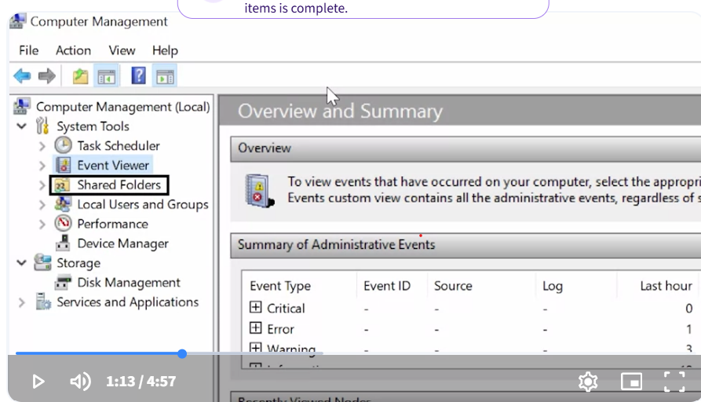

# There are two different types of users
- standard users
- Administrators 

### Standard user
One who is given access to a machine but has restricted access to do things like install software or change certain settings

### Admin
A user that has complete control over a machine 

### Computer management 
allows you to make who is admin and who is standard user

### Windows domain
A network of computers, users, files, ect that are added to a central database 

### User Account Control (UAC)
A feature in Windows that prevent unauthorized changes to a system 

use CLI command Get-LocalUser to get info on all users and what their role is and permissions
and Get-LocalGroup will get groups on the machine

example for both
Get-LocalGroupMember Administrators

### Root User
First user that gets automatically created when we install a Linux OS

### sudo command or superuser do
allows a user to make commands like a root user
- if you use sudo -su, you can log in as root user

When you set a password it's securely scrambled, then stored in a special privileged file called /etc/shadow