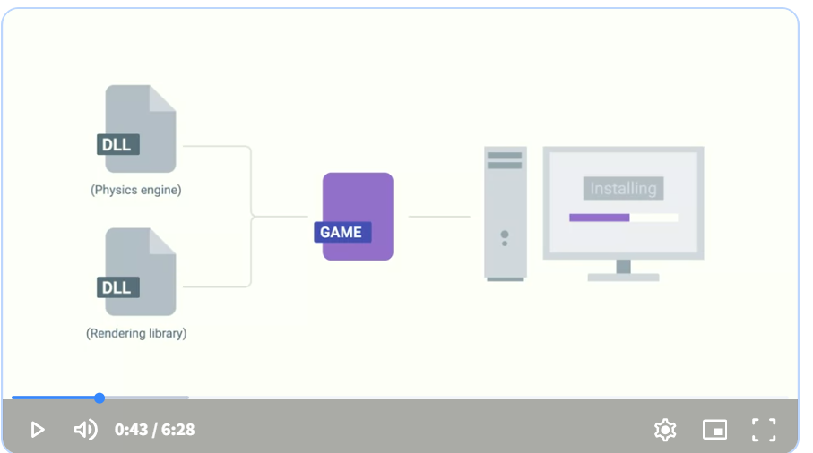

### Executable file (.exe)
Contain instructions for a computer to execute when they're run

### Microsoft install package (.msi)
Used to guide a program called the Windows Installer in the installation, maintenance, and removal of programs on the Windows operating system 

### Debian
Packaged as a .deb file for Debian 
A .deb file is a software package used by Debian-based Linux systems.

- grep allows you to search for key terms 

### Side-loading
Where you install mobile apps directly, without using an app store, This is not typical and can be dangerous usually only app devs do this

- Mobile apps are standalone software packages, so they contain all their dependencies 

### Archive 
Comprised of one or more files that's compressed into a single file 

### Package archives 
the core or source software files that are compressed into one file 
- an example are zip files

To extract a file using 7zip, use the command 7z and the flag e for extract and then the file you want to extract 

### Having dependencies 
Counting on other pieces of software to make an application work, since one bit of code depends on another, in order to work

### Library
A way to package a bunch of useful code that someone else wrote 

### MSI File
A file that tells Windows how to put it all together 

### Package mangers
Come with the works to make package installation and removal easier. including installing package dependencies 

- What PowerShell command can be used to extract and compress archives right from the command line? 

Compress-Archive
