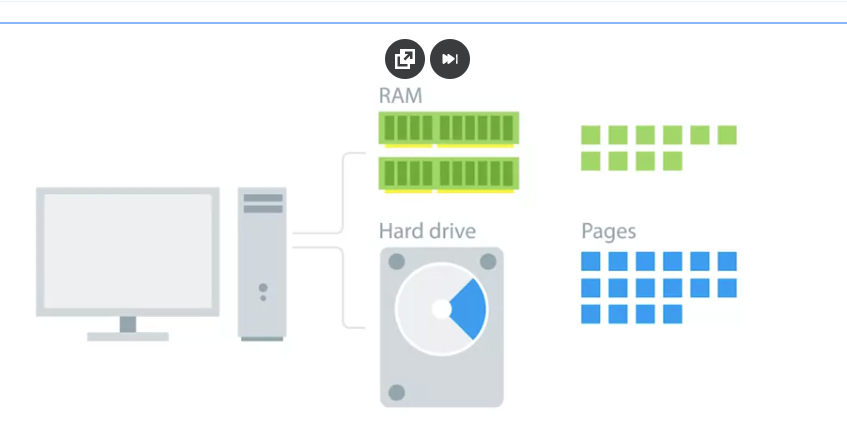
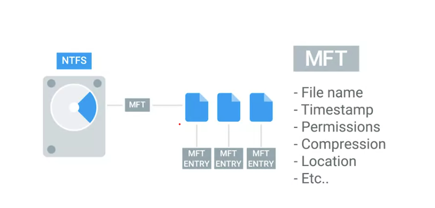

### Filesystem
Used to keep track of files and file storage on a disk

### FAT32
A file system used to organize and store files on storage devices. It supports storage volumes up to about 2 TB, but individual files can be no larger than 4 GB − 1 byte.

### Partition 
The piece of a disk that you can manage 

- When you format a filesystem on a partition it becomes a volume 

### Partition table
Tells the OS how the disk is partitioned 

# Two main partition table schemes
1. Master Boot Record (MBR): An older partitioning system that stores information about disk partitions and boot information. It supports drives up to about 2 TB and allows up to 4 primary partitions.

2. GUID Partition Table (GPT): A newer partitioning system that replaces MBR. It supports much larger drives and allows many more partitions. It is commonly used with modern UEFI systems.

- Disk partitioning enables more efficient management of hard disk space by breaking or “slicing” up the disk storage space into partitions.

# Key Takeaways
DiskPart is a tool that lets you manage your storage from a command line interface and is useful for a multitude of actions including creating, deleting, merging, and repairing drives.

- The three main divisions of storage that you will find on a drive are cluster, volume, and partition. 

- To use DiskPart you will need to use specific commands to select and manage the parts of your drive you need to access. 

- Cluster size is the smallest division of storage possible in a drive. Cluster size is important because a file will take up the entire size of the cluster regardless of how much space it actually requires in the cluster.

### Mounting 
Making something accessible to the computer, like a filesystem or a hard disk

### Virtual memory
How our OS provides the physical memory available in our computer (like RAM) to the applications that run on the computer

- Virtual Memory: Uses storage space as extra RAM.

- Paging: Moves data between RAM and storage when RAM is full.

### Swap space
In Linux, the dedicated area of the hard drive used for virtual memory 

- Inodes store everything about a file, except for the filename and the file data.

The idea behind disk defragmentation is to take all the files stored on a given disk, and reorganize them into neighboring location

### Data buffer
A region of RAM that's used to temporarily store data while it's being moved around and it's the reason why you want to eject drives before removing them otherwise you risk data corruption 