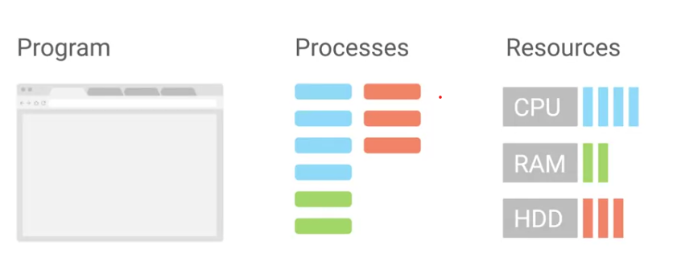

### Programs 
The applications that we can run, like the chrome web browser 

### Processes 
Programs that are running 

- taskkill can end a process on the CLI can use PID to tell Linux what process you want stopped

When you startup your computer, the kernel creates a process called **init**, which has a **PID of 1** 